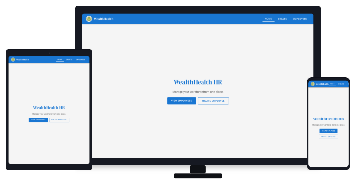

<h1 align="center">WealthHealth</h1>

[](https://www.typescriptlang.org)
[](https://react.dev)
[](https://reactrouter.com)
[](https://nodejs.org)
[](https://vitejs.dev)
[](https://eslint.org)
[](https://prettier.io)
[](https://stylelint.io)
[](https://github.com/GoogleChrome/lighthouse-ci)

<div align="center">
  
</div>

OpenClassrooms **HRnet** migration: a React + TypeScript SPA to create and list employees, keep the roster in **in-memory React context** (refresh clears it), validate inputs, and ship a responsive layout with optional **Lighthouse CI** in GitHub Actions.

## Live demo and resources

| Resource               | URL / link                                                                                 |
| ---------------------- | ------------------------------------------------------------------------------------------ |
| Language               | English · [Français](./README.fr.md)                                                       |
| Architecture           | [ARCHITECTURE.md](./ARCHITECTURE.md)                                                       |
| ArchitectureFr         | [ARCHITECTURE.fr.md](./ARCHITECTURE.fr.md)                                                 |
| GitHub                 | https://github.com/Steinshy/OC-WealthHealth                                                |
| Live demo              | https://steinshy.github.io/OC-WealthHealth/                                                |
| Modal package (npm)    | [@steinshy/wealthhealth-modal](https://www.npmjs.com/package/@steinshy/wealthhealth-modal) |
| Modal package (GitHub) | [OC-WealthHealth-modal](https://github.com/Steinshy/OC-WealthHealth-modal)                 |

## Features

- **Employee CRUD-style flows** — Create form with US states, departments, dates, and address block; list with search, sort, and pagination
- **Client-side state** — Employees live in `EmployeeContext` (`useReducer`); no `localStorage` or API persistence in this repo
- **TypeScript-first** — Strict typing for domain models and hooks
- **React Router 7** — `BrowserRouter` with `basename` from `import.meta.env.BASE_URL` for GitHub Pages
- **Component layout** — Shell (`Layout`, `PageTemplate`), feature modules under `features/employees`, shared UI and patterns
- **Responsive UI** — Breakpoints at 768px / 480px, horizontal scroll for the wide employee table on small screens, safe-area aware app bar
- **Quality tooling** — ESLint 10, Stylelint 17, Prettier 3, Knip, TypeScript checks in build and optional Vite checker in dev

## Prerequisites

- **Node.js** >= 22 (see `engines` in `package.json`; `.nvmrc` pins 24)
- **pnpm** 10+ — enable via [Corepack](https://nodejs.org/api/corepack.html) (`corepack enable`) or install from [pnpm.io](https://pnpm.io/installation)

## Install

```bash
git clone https://github.com/Steinshy/OC-WealthHealth.git
cd OC-WealthHealth
pnpm install
```

## Quick Start

### Development server

```bash
pnpm run dev
```

The app is served at **http://localhost:5173** (see `vite.config.ts`).

### Production build and preview

```bash
pnpm run build
pnpm run preview
```

Preview defaults to **http://localhost:3000**.

### Success modal after creating an employee

`Create.tsx` wraps the form in `PageTemplate`, uses `Modal` from `@steinshy/wealthhealth-modal`, and calls `setTheme('light')` so the modal matches the app shell:

```tsx
import { Modal, useTheme } from '@steinshy/wealthhealth-modal';
import { PageTemplate } from '@/components/shell';
import { EmployeeForm } from '@/features/employees';
import { useEffect, useState } from 'react';
import { useNavigate } from 'react-router';

export const Create = () => {
  const navigate = useNavigate();
  const [showModal, setShowModal] = useState(false);
  const { setTheme } = useTheme();

  useEffect(() => {
    setTheme('light');
  }, [setTheme]);

  const handleCloseModal = () => {
    setShowModal(false);
    navigate('/employees');
  };

  return (
    <PageTemplate pageHeading="Create a new employee">
      <EmployeeForm onSuccess={() => setShowModal(true)} />
      <Modal
        isOpen={showModal}
        onClose={handleCloseModal}
        title="Success"
        status="success"
        autoCloseDuration={1500}
      >
        <p>Employee Created!</p>
      </Modal>
    </PageTemplate>
  );
};
```

## Routes

| Path         | Description                                     |
| ------------ | ----------------------------------------------- |
| `/`          | Home — entry hero and navigation to create/list |
| `/create`    | Create employee form + success modal            |
| `/employees` | Searchable, sortable, paginated employee table  |

## Project structure

```
src/
├── App.tsx                 # Routes + EmployeeProvider + BrowserRouter
├── main.tsx
├── index.css               # Global tokens, fonts, reset
├── context/
│   └── EmployeeContext.tsx # In-memory employee list (useReducer)
├── features/employees/     # Form, table, list controls
├── components/
│   ├── shell/              # Layout, PageTemplate
│   ├── patterns/         # SearchInput, Pagination, SortableTh, …
│   └── ui/                # Button, TextInput, Select, …
├── pages/
│   ├── Home/
│   └── employees/         # Create, List
├── hooks/                  # useFilter, useSortableData, usePagination, …
├── helpers/
│   └── validator.ts       # Form validation rules
├── types/
│   └── index.ts           # Employee, State
└── utils/
    └── states.ts          # US states list and departments
```

## pnpm scripts

| Script                             | Description                                     |
| ---------------------------------- | ----------------------------------------------- |
| `pnpm run dev`                     | Vite dev server (port 5173)                     |
| `pnpm run build`                   | Typecheck + production bundle to `dist/`        |
| `pnpm run preview`                 | Serve `dist/` (port 3000)                       |
| `pnpm run type-check`              | `tsc --noEmit` only                             |
| `pnpm run lint`                    | ESLint                                          |
| `pnpm run lint:styles`             | Stylelint                                       |
| `pnpm run format` / `format:check` | Prettier                                        |
| `pnpm run knip`                    | Unused files, exports, and dependency check     |
| `pnpm run lighthouse`              | Lighthouse CI (uses `.lighthouserc.local.json`) |

## Data model

While the session lasts, employees are held in context. Each new record gets an `id` from `crypto.randomUUID()` when it is added.

```typescript
export interface Employee {
  firstName: string;
  lastName: string;
  dateOfBirth: string;
  startDate: string;
  department: string;
  street: string;
  city: string;
  state: string;
  zipCode: string;
}

// As stored in context: the id is assigned on creation
export interface StoredEmployee extends Employee {
  id: string;
}
```

## Styling

Global **Material-inspired** tokens live on `:root` in `src/index.css`. Breakpoint tokens (`--mu-bp-mobile`, `--mu-bp-tablet`) document the literals used in `@media` queries across component CSS.

```css
:root {
  --mu-bp-mobile: 480px;
  --mu-bp-tablet: 768px;
  --mu-primary: #1976d2;
  --mu-primary-dark: #1565c0;
  --mu-bg: #f5f5f5;
  --mu-surface: #fff;
  --mu-text-primary: rgb(0 0 0 / 87%);
  --mu-text-secondary: rgb(0 0 0 / 60%);
  --mu-divider: rgb(0 0 0 / 12%);
  --mu-error: #d32f2f;
  --mu-shadow-1: /* elevation */;
  --mu-shadow-4: /* app bar shadow */;
}
```

Component-scoped rules use co-located `*.css` files (not CSS Modules). Override by editing those files or extending rules in `index.css`.

## Accessibility

- Semantic HTML for forms, tables, and navigation
- Labels tied to inputs via shared `Label` / `FormField` patterns
- Sortable column headers implemented as accessible buttons (`SortableTh`)
- Visible focus styles on interactive controls (respect browser defaults where not overridden)
- Minimum tap targets improved on small viewports for the app bar, table header actions, and primary buttons

## Browser support

| Browser | Notes  |
| ------- | ------ |
| Chrome  | Latest |
| Firefox | Latest |
| Safari  | Latest |
| Edge    | Latest |

## License

[MIT](./LICENSE)

---
